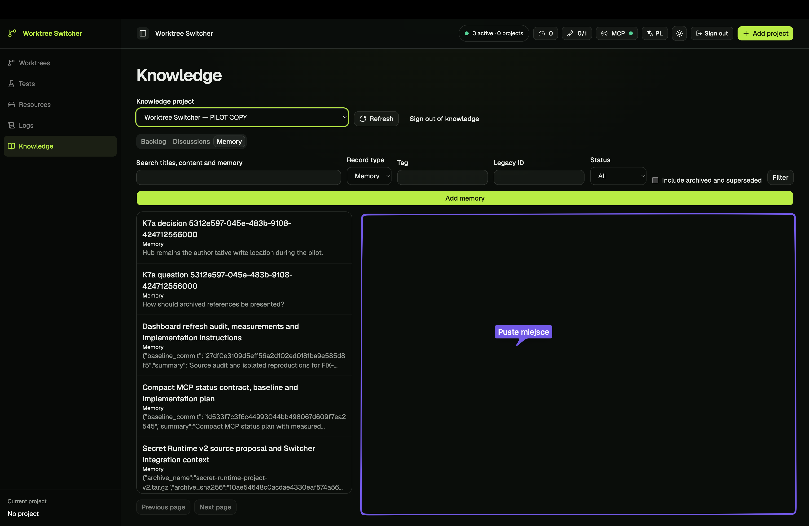
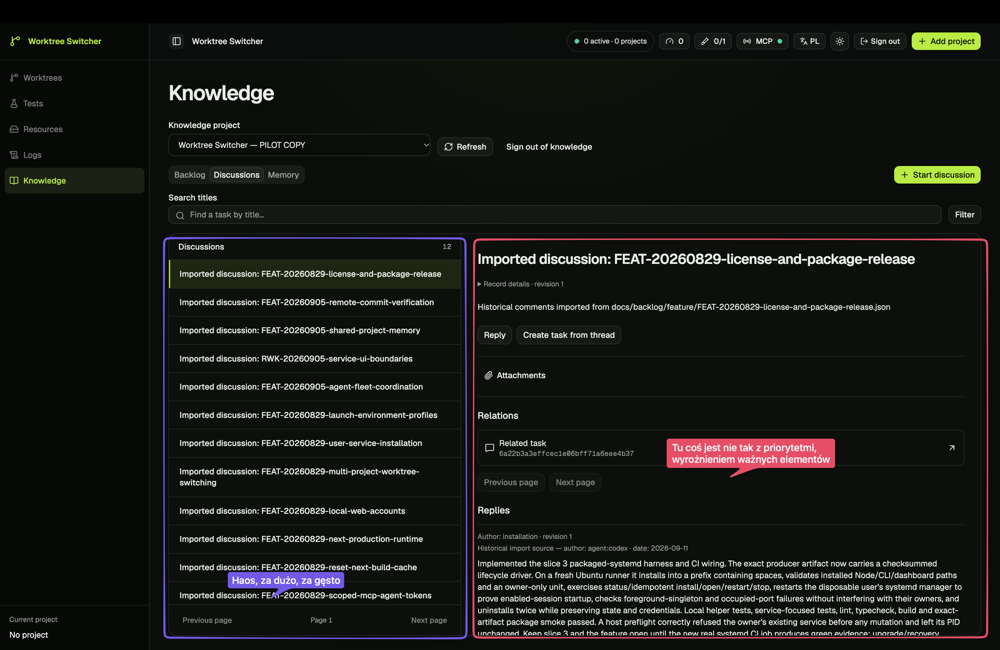
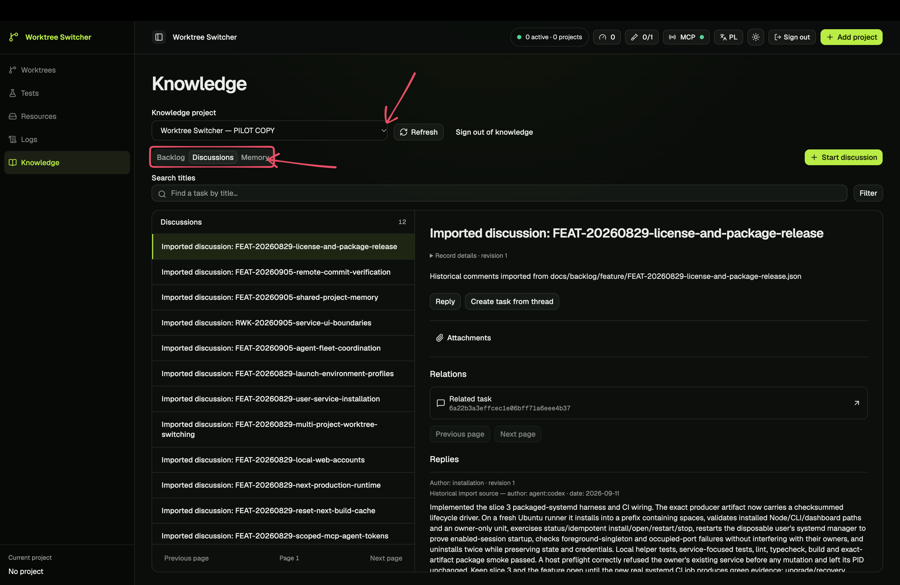
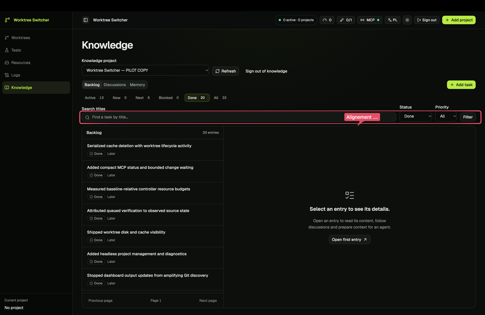

# Uwagi właściciela do czytania wiedzy

Data: 2026-09-28. Właściciel otworzył odizolowaną kopię audytową i przekazał cztery opisane zrzuty. Zachowano oryginalne obrazy bez zmian. To dodatkowe dowody od człowieka, oddzielone od 19 zrzutów Playwright w [raporcie](visual-audit.md). Nie znamy ustawień zoomu ani CSS viewportu tych obrazów; nie przenosimy na nie pomiarów z Playwright.

## 1. Lista pamięci bez wybranego wpisu — źle wykorzystana przestrzeń

Adnotacja właściciela: **„Puste miejsce”**. Zaznaczona prawa część zajmuje większość obszaru pod filtrami, podczas gdy treść listy pozostaje w wąskiej kolumnie.

Wniosek: samo dodanie komunikatu „Wybierz wpis” poprawiłoby orientację, ale nie rozwiąże zgłoszonego marnowania przestrzeni. Poprzedni plan był tu zbyt zachowawczy (KR-11).

Propozycja: przed wyborem rekordu pokazać użyteczną listę w dostępnym obszarze, z ograniczoną długością tekstu, krótkim opisem i czytelnymi metadanymi. Po świadomym otwarciu przejść do listy i czytnika; udostępnić rozszerzenie samego czytnika. Nie otwierać automatycznie przypadkowego pierwszego rekordu i nie rozciągać akapitów na całą szerokość monitora. Zachować pozycję i fokus przy zmianie układu.

## 2. Lista dyskusji i szczegół — zbyt duża gęstość, niewłaściwa hierarchia

Adnotacja do listy: **„Haos, za dużo, za gęsto”**. Adnotacja do szczegółu: **„Tu coś jest nie tak z priorytetmi, wyróżnieniem ważnych elementów”**. Cytaty zachowują pisownię właściciela.

Lista powtarza długie „Imported discussion: FEAT-…” w każdym wierszu. Techniczne oznaczenie dominuje nad znaczeniem rozmowy. W szczególe treść odpowiedzi zaczyna się dopiero po nagłówku importu, metadanych, opisie pliku źródłowego, akcjach, sekcji załączników, relacji i nieaktywnych przyciskach stronicowania. Samo zwiększenie odstępów wydłużyłoby dojście do rozmowy.

Propozycja dla listy: ludzki tytuł jako główna treść, krótki podgląd ostatniej wypowiedzi lub tematu oraz drugorzędna data/autor. Pochodzenie importu i legacy ID pozostają dostępne, ale nie są powtarzanym początkiem każdej pozycji. Więcej odstępu między tematami; mniej równocześnie konkurujących informacji. Nie wymyślać tytułu: wykorzystać dostępny tytuł powiązanego zadania albo jawny fallback, zgodnie z modelem odczytu.

Propozycja dla szczegółu: tytuł i krótki kontekst, następnie właściwa rozmowa z widocznym autorem i datą. Powiązania, załączniki i dane importu umieścić w drugorzędnych, rozwijanych sekcjach lub panelu kontekstu. Plik będący główną treścią notatki nadal ma być łatwo dostępny — nie przenosić mechanicznie tej reguły z dyskusji na notatki. Ukryć kontrolki stronicowania sekcji, w której nie ma kolejnej ani poprzedniej strony; zachować informację o liczbie elementów, jeśli pomaga.

Odbiór hierarchii: po otwarciu wybranej dyskusji na uzgodnionym desktopie widoczny tytuł, autor/data i początek pierwszej odpowiedzi bez przewijania przez bloki administracyjne. Na telefonie rozmowa również poprzedza drugorzędny kontekst. Nie usuwać pochodzenia ani nie zmieniać zapisanej treści dla wyglądu.

## 3. Projekt i zakładki — obszar wskazany do przeprojektowania

Właściciel zaznaczył strzałkami selektor projektu oraz grupę Backlog / Discussions / Memory. Obraz nie ma opisu problemu w tych miejscach. Nie traktujemy strzałek jako zgłoszenia niedziałającego selektora, prośby o usunięcie zakładek ani akceptacji konkretnej nawigacji.

Propozycja do oceny: jeden czytelny nagłówek bieżącego projektu wiedzy z możliwością zmiany, pod nim pełnoprawna nawigacja trzech sekcji. Wyraźniejszy stan aktywnej sekcji, większe cele kliknięcia, mniej konkurujących wierszy nad treścią. Zmiana projektu ma pozostawać dostępna bez mieszania go z osobnym kontekstem runtime. Dopiero wspólna ocena widoku pokaże, czy trafia to w intencję zaznaczenia.

## 4. Wiersz filtrów backlogu — niespójne wyrównanie

Właściciel zaznaczył cały wiersz wyszukiwania, stanu, priorytetu i przycisku, z adnotacją **„Alignement ....”**. Na obrazie kontrolki mają niespójne górne krawędzie i wysokości. Nie wyznaczamy dokładnej różnicy pikselowej bez znajomości skali dostarczonego obrazu.

Propozycja: wspólna wysokość pola tekstowego, selectów i przycisku; wspólna linia etykiet, jednakowy odstęp etykieta–kontrolka, dolna krawędź i przewidywalne odstępy między grupami. Zastosować jeden wzorzec w backlogu, dyskusjach i pamięci. Po zawinięciu do kolejnego wiersza etykieta pozostaje ze swoim polem. Nie korygować tego pojedynczym przesunięciem przycisku zależnym od rozmiaru ekranu.

Odbiór: porównanie krawędzi i wysokości rzeczywistych elementów w przeglądarce, PL/EN, widoki szeroki/wąski, długie etykiety i zoom 200%; focus ring nie jest przycięty. Wyrównanie nie może ponownie ścisnąć pola wyszukiwania do minimalnej szerokości.

## Wpływ na plan

Uwagi wzmacniają KR-09–KR-11 i zmieniają akcent [pierwszego etapu](implementation-plan.md): najpierw użyteczny układ listy, hierarchia rozmowy i nawigacja projektu, równolegle z poprawą rozmiaru i wyrównania filtrów. Nie wystarczy schować formularza i dodać pustego stanu. Czytnik dokumentów, kolejność historycznych odpowiedzi i trafne wyszukiwanie nadal pozostają konieczne w następnych zakresach.

Oceny właściciela zapisano jako kierunek prac. Wszystkie konkretne rozwiązania powyżej są propozycjami agenta; przesłanie zrzutów nie jest zatwierdzeniem makiety ani rozpoczęciem implementacji.
