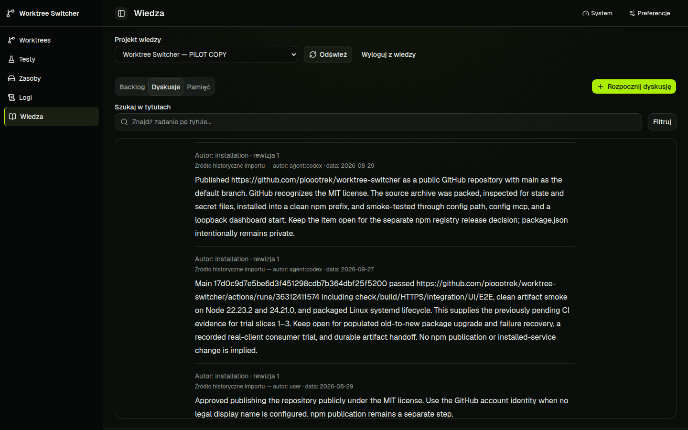
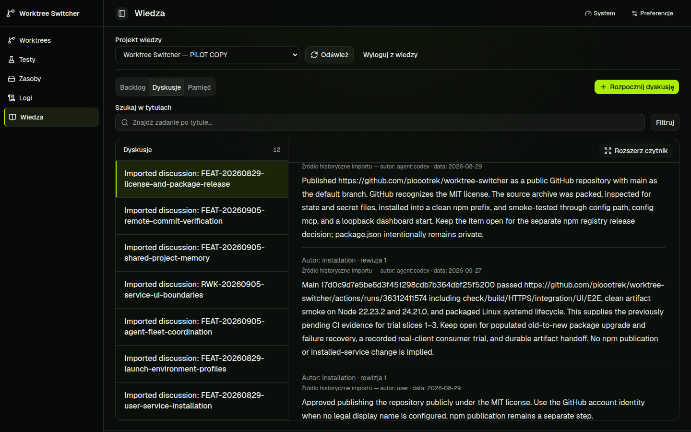

# Reader layout return follow-up

PR: https://github.com/pioootrek/worktree-switcher/pull/60

The owner reported that Show list was not visible after Expand reader. Both
Knowledge and Memory placed layout controls inside their scrolling content.
On the isolated pilot at 1440 by 900, expanding a real discussion then setting
its reader scroll to 600 moved the restore button to viewport y=-302..-270.

The fix keeps the action bar outside the desktop content scroll pane. Named
keyboard-focusable content regions, selected record, filters and list state are
preserved. Mobile content remains in page flow. The same pilot on `975e45b`
kept Show list at y=298..330 with a successful center hit test while content was
scrolled to 600. Clicking it restored the list and the same selected discussion;
text reflow adjusted the content offset to 628. At 390 by 844, page content was
not horizontally overflowing and Back to list restored the list.

Managed verification on clean source `975e45b`:

- Check `5f260b17-e548-42a9-9cc0-4d8cced826d9`: passed, 495 unit tests and 7 resource checks.
- Build `852d4f4e-19b0-45c8-b902-2e8dcab55541`: passed.
- UI `976b91cf-1b79-4dff-a8e1-e046f6b66fab`: 105 passed. New cases cover Backlog, Discussions and Memory deep-scroll restoration, responsive transitions, focus/list/query state, and retaining an open document without another byte fetch.
- [GitHub Verify 36452700075](https://github.com/pioootrek/worktree-switcher/actions/runs/36452700075): green, including transport/integration/UI/E2E, Node 22/24 package smoke and packaged systemd lifecycle.

Merged as `26ecb21` after green CI. n8n review was dispatched once with target all.
Kimi and Codex completed without actionable findings; no inline threads were
created. Claude stopped at its session limit without reviewing. The
preview runs on the reader-return worktree on port 3001, with its claim released.
