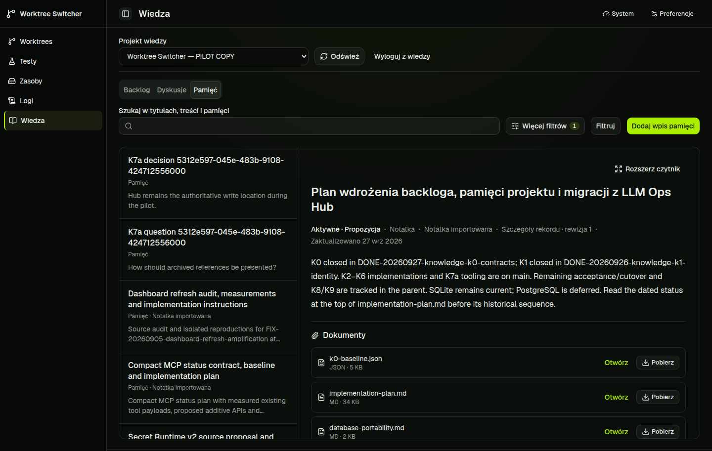
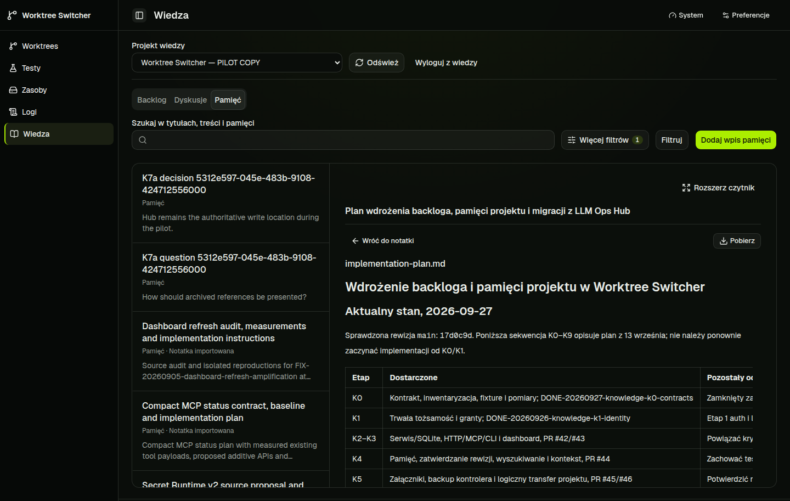
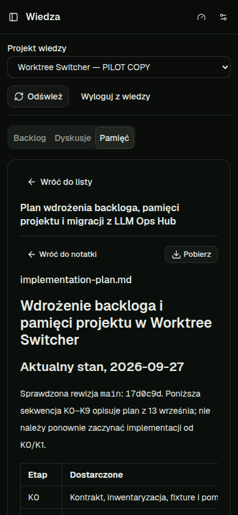
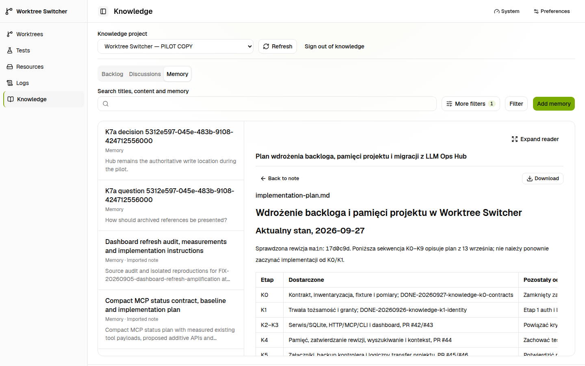
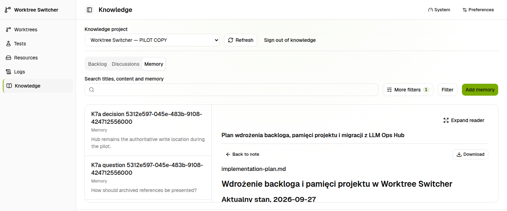
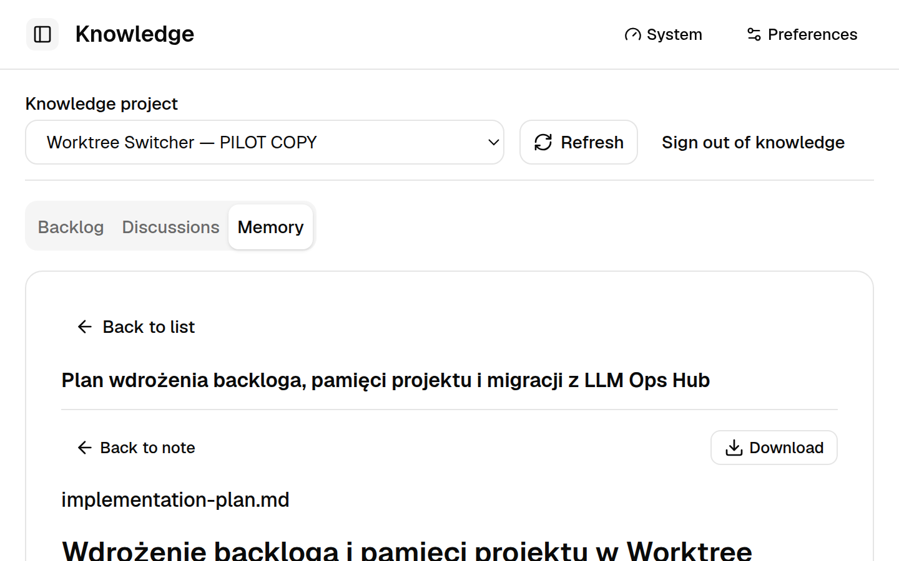

# Knowledge reading: stage 2 progress

PR: https://github.com/pioootrek/worktree-switcher/pull/59

## Delivered behavior

Imported notes show provenance-backed summaries, their documents, and a secondary
original-payload disclosure. Native JSON and edited bodies remain ordinary text.
Markdown, UTF-8 text and raster files open in the authorized note context, with
separate byte-preserving download. Sibling links resolve only known relative
paths; unsupported, invalid, oversized or inaccessible files have explicit states.
No schema migration, reimport or persistent-body rewrite is included.

Document URLs support reload and Back. Selected documents use compact note context
so the document body gets the main reading area. File lists show paths, extensions
and size instead of generic octet-stream MIME. The existing shadcn preset remains.

## Pilot evidence

The owner-authorized isolated pilot ran through the managed server on the reading
integration worktree. Source/layout revision for these screenshots: `656718c`.
Later focus and refresh corrections require regression verification below.

- Desktop PL/dark note and document: 1440 CSS pixels wide.
- Mobile PL/dark document: 390 by 844, no page-wide horizontal overflow.
- Desktop EN/light: 1440 by 900, and short viewport 1440 by 600.
- Real Chromium 200% zoom: physical viewport 1440 by 900, CSS viewport 720 by
  450, device pixel ratio 2; no page-wide horizontal overflow. Captured through
  CDP without clipping. This is a reflow check, not a complete accessibility audit.
- A real sibling link opened database-portability.md; browser Back restored
  implementation-plan.md. A copied document URL loaded the document after sign-in.
- The original implementation-plan.md downloaded as 34,728 bytes. SHA-256 matched
  authorized attachment metadata:
  `3bc5f4fb83245b94d0233099f7dcf9f47e27d79051eae59556e9f6d40e4fba8d`.
- Cross-note/source-repository links remain explicitly unavailable; this stage
  resolves authorized siblings only. Wide tables/code have local scroll regions.

## Verification and review

In progress. Final revision, managed runs, CI and review dispositions will be
recorded before closing this slice. Initial failed checks and interrupted runs
are not passing evidence. Existing native editing, ownership and authentication
flows remain part of the regression suite.

## Owner follow-up

After this slice, discuss why Markdown exists in imported Knowledge and whether
it should be the intended content format. The owner explicitly deferred that
discussion; this slice does not decide or migrate the data model. The broader GUI
rework remains open for the subsequent agreed scopes.
