# Pozostałe GUI: Worktrees, Testy, Zasoby i Logi

Audyt wykonany 2026-09-28, po rozszerzeniu zakresu przez właściciela („A co z resztą?” i „tak, to pytam co teraz?”). Uzupełnia [audyt Wiedzy](visual-audit.md) oraz [cztery uwagi właściciela](owner-feedback.md). [Wspólny plan](whole-gui-plan.md) określa kolejność następnych zmian. To audyt działającego interfejsu, bez zmian kodu aplikacji.

## Werdykt

Problem jest wspólny: podsumowania, kontekst techniczny i filtry zajmują miejsce przed właściwą pracą. W Wiedzy zasłaniają treść; w Worktrees utrudniają dostęp do działania; w Testach opóźniają dotarcie do wyniku. Zasoby mają najbardziej czytelny podział listy i szczegółu. Logi mają użyteczne narzędzia czytania, ale wyszukiwanie wszystkich projektów rozwija również puste konsole.

Nie należy przepisywać całego dashboardu. Najpierw trzeba naprawić wspólny układ i hierarchię, zachowując prawdziwe stany, ograniczenia operacji i zatwierdzony kierunek grafit/lime.

## Metoda i granice

Chromium przez Playwright, ten sam autoryzowany pilot, kod `e4a3a2f3d0b37ba5ea1a0e36d0838c0ea850811d`. Trzy syntetyczne repozytoria, po dwa prawdziwe Git worktree: Portal (działający serwer, claim, lokalna zmiana na drugiej gałęzi), API (zatrzymany), Worker (zamierzony błąd startu, exit 7). Syntetyczne logi i 2 MiB cache. Dane Wiedzy pochodzą z wcześniejszej kopii i nie zostały zmienione w tej części.

Start i stop wyłącznie przez MCP kontrolera pilota; wyniki przez jego kolejkę, limit 1 bez zmian. Trzy testy przeszły, jeden celowo zakończył się błędem 9, jeden anulowano w UI przed startem. Nie są to testy regresji kodu Switchera. Screenshoty wykonano kolejno i każdy otwarto do inspekcji. Animacje wyłączono podczas zdjęć; dwa początkowe zdjęcia przejściowych stanów dialogów zastąpiono stabilnymi.

Desktop 1440×1000 PL/dark; jeden dodatkowy przegląd Worktrees EN/light. Mobile to viewport 390×844, nie fizyczne urządzenie. Sprawdzono częściowo klawiaturę: Escape i powrót fokusu w szczególe testu, Enter w wynikach wyszukiwania logów. Nie przeprowadzono pełnego audytu dostępności, czytnika ekranu, zoomu 200%, dużej liczby projektów, długiej historii logów, awarii sieci ani wszystkich ustawień. Nie wykonano usuwania cache, usuwania projektu, przełączenia worktree przez UI ani zatwierdzenia formularza uruchamiania testu; formularz obejrzano, testy uruchamiano MCP. Wykres dysku miał jedną próbkę. Nie oceniono trendów wielodniowych.

## 1. Worktrees: rozpoznanie projektu i działającej gałęzi — wymaga poprawy

Zatrzymany projekt pokazuje dwie gałęzie, a działający wyróżnia rzeczywistą gałąź oraz lokalne zmiany. Rezerwacja blokuje przełączenie przez innego aktora. To wartościowe i trzeba zachować.

**RT-01, P1:** akcje wiersza wychodzą poza początkowy widok tabeli już na 1440 px. W widoku pojedynczego projektu kontener miał 1070 px przy zawartości 1122 px. Można przewinąć poziomo, więc nie jest to brak akcji w DOM. Główna operacja powinna jednak być widoczna bez poszukiwania jej za prawą krawędzią. W tabeli zbiorczej dochodzi kolumna projektu.

**RT-02, P2:** pełna ścieżka, techniczny identyfikator właściciela rezerwacji i duży blok ostrzeżenia dominują nad listą. Proponowane: krótka informacja kto i co blokuje, a szczegóły identyfikacji rozwijane. Nie ukrywać samego powodu blokady.

Karta „Serwer” działa jak filtr tabeli (zdjęcie 03), nie otwiera szczegółu. Nazwa pliku jest historyczna. Warto dodać widoczny stan filtra/akcję, zamiast polegać na domyśle, że każda karta podsumowania jest przyciskiem.

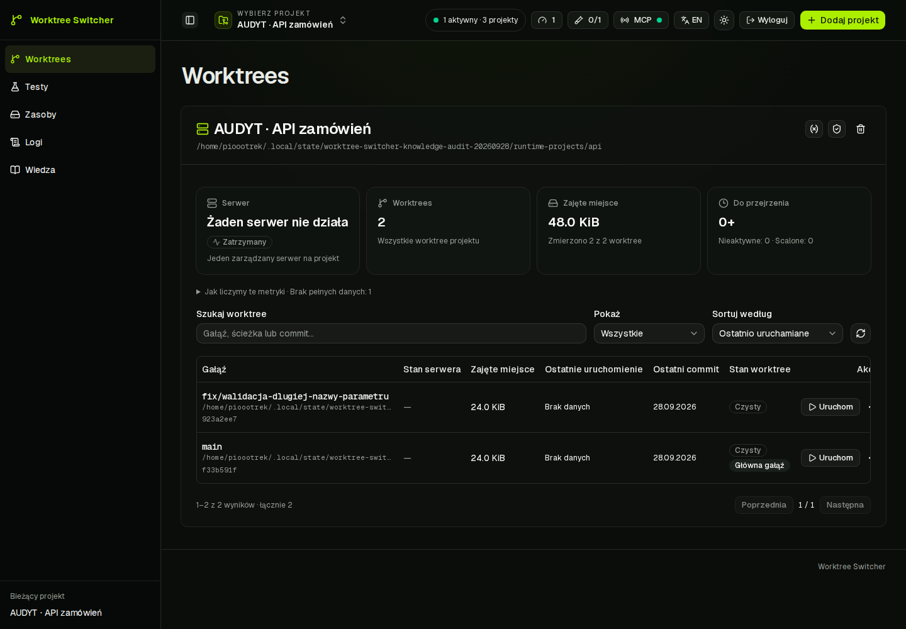
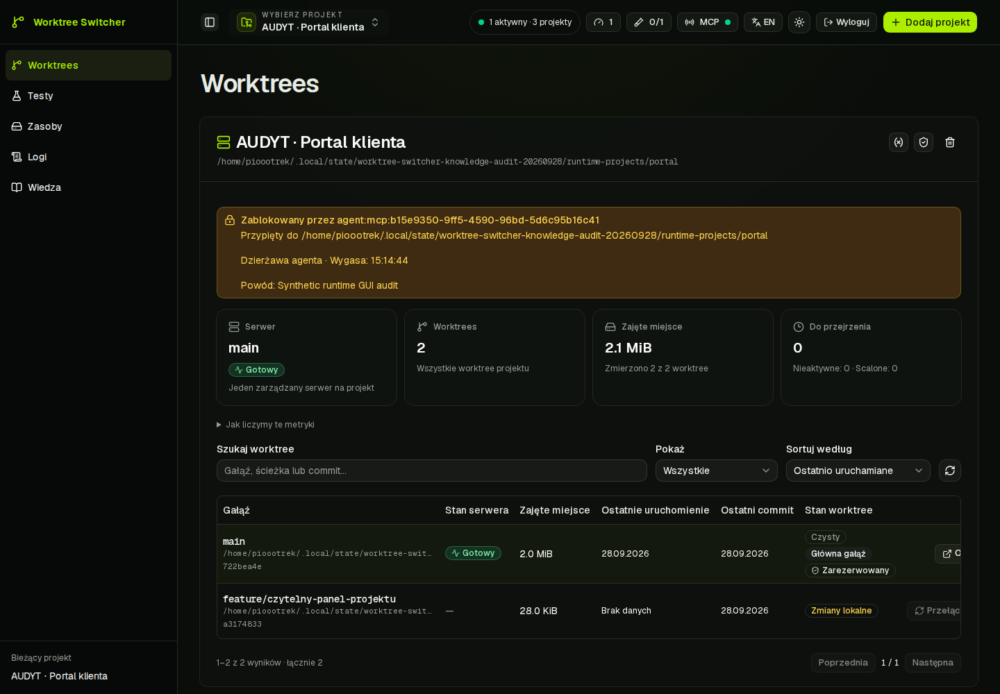
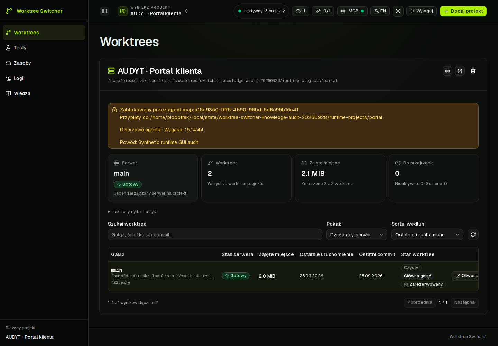

## 2. Wszystkie projekty i błąd startu — stan jest widoczny, powiązanie słabe

**RT-03, P2:** globalny komunikat poprawnie opisuje błąd Workera, ale jego wiersz main pokazuje „—” w stanie serwera. W Zasobach ten sam projekt pokazuje „Błąd”, a w Logach wskazuje ostatnie uruchomienie. Po przewinięciu daleko od alertu trudno połączyć problem z wierszem. Proponowane: pokazać ostatnią nieudaną próbę na właściwym worktree z linkiem do jej logów; nie oznaczać wszystkich gałęzi jako uszkodzonych.

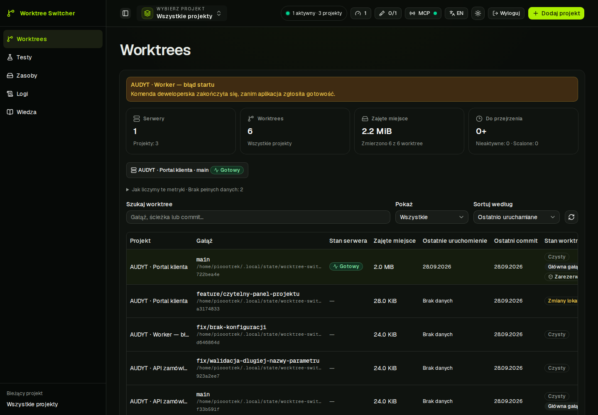

## 3. Testy: wynik i wyjaśnienie — mechanizm działa, znaczenie wymaga doprecyzowania

Wyniki passed/failed i exit code odpowiadają wykonaniu. Szczegół pokazuje komendę, log i obserwacje źródła. Escape zamyka panel, a fokus wraca na przycisk otwierający wynik.

**RT-04, P1:** kolumna „Źródła” pokazuje „Brak danych”, mimo że szczegół informuje „Źródło zgodne w punktach obserwacji”, po czym znowu „Brak danych”. To różne pojęcia: zgodność obserwacji podczas wykonania oraz aktualność wyniku względem obecnego worktree. `test-results-model.ts` uzależnia aktualność także od czystego worktree, zgodnego HEAD i świeżych metadanych. Nie stwierdzono utraty proweniencji: MCP potwierdza `observed_match`. Przyczyna konkretnego braku aktualności w przeglądarce nie została rozstrzygnięta. Naprawić etykiety, podać powód nieznanej aktualności, nie zastępować nieznanego stanu zielonym sukcesem.

**RT-05, P1:** cztery duże karty, pusty panel kolejki i siedem filtrów odsuwają historię. Na desktopie bez aktywnej kolejki tabela zaczynała się około y=691, z kolejką około y=820. Pusta kolejka powinna być zwięzłą informacją; wynik i jego przyczyna mają pierwszeństwo.

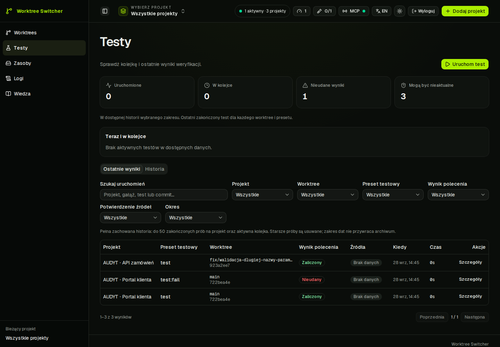
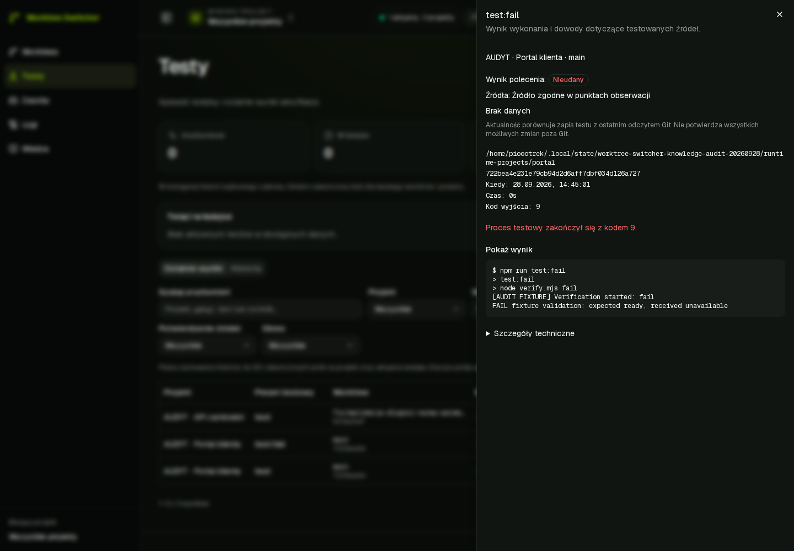

## 4. Uruchomienie i anulowanie testu — zasadniczo czytelne

Dialog ma sensowną kolejność projekt → worktree → preset, opcje zaawansowane są zwinięte. Przycisk zamknięcia dialogu ma jednak angielską nazwę dostępną „Close” w PL (RT-06, P2). Uruchomiony przez MCP test hold pojawił się jako aktywny, drugi jako oczekujący na pozycji 1. Anulowanie drugiego z UI dało komunikat i potwierdzony terminalny stan `cancelled`, `startedAt=null`. Pierwszy zakończył się `passed`. Ikony anulowania mają nazwy dostępne; sam znak pozostaje mało objaśniający wzrokowo.

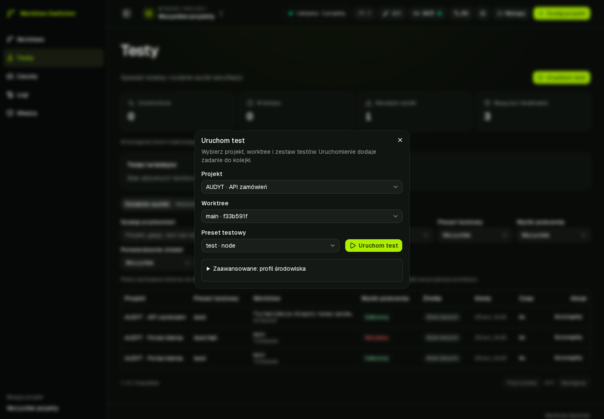
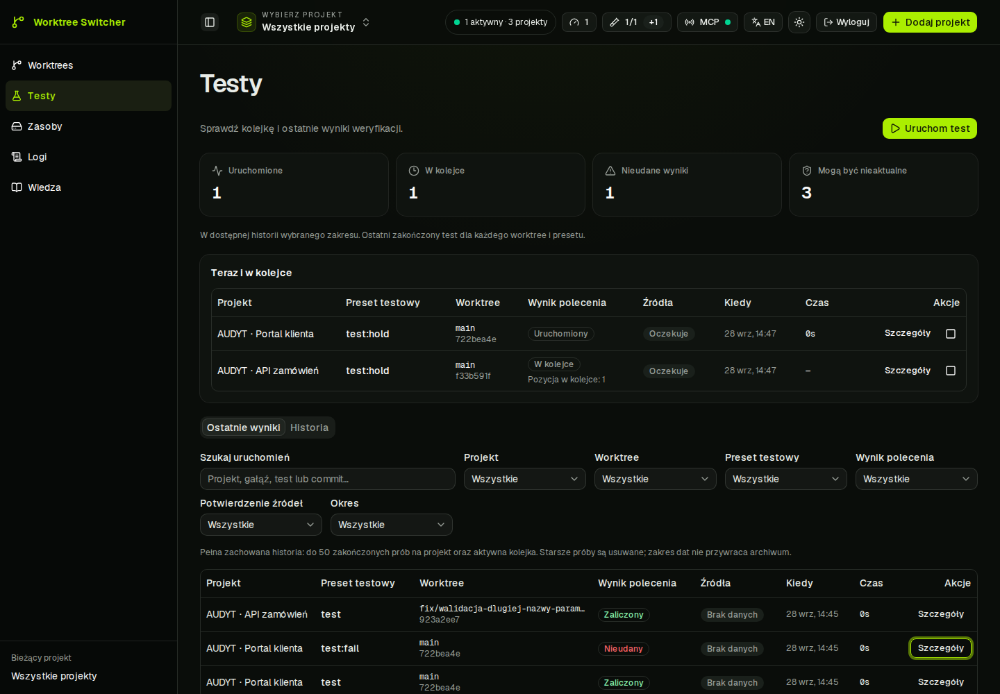

## 5. Zasoby: dysk i bezpieczne działania — dobry punkt wyjścia

Tabela pokazuje udział .next, czas pomiaru i szczegóły. Panel rozdziela wartości i największe katalogi. „Usuń .next” jest zablokowane z konkretnym wyjaśnieniem, że serwer tego worktree działa. Nie wykonywano usunięcia.

**RT-07, P2:** pojedynczy pomiar daje wizualnie pusty wykres historii, mimo dostępnych danych liczbowych. Kod rysuje polyline nawet dla jednego punktu; brak widocznego markera. Dodać punkt i opis „pierwszy pomiar”, zamiast sugerować pustą historię. Wykresy potrzebują również tekstowej alternatywy wartości/czasów; sprawdzono nazwę dostępną obrazu, nie obsługę przez czytnik ekranu.

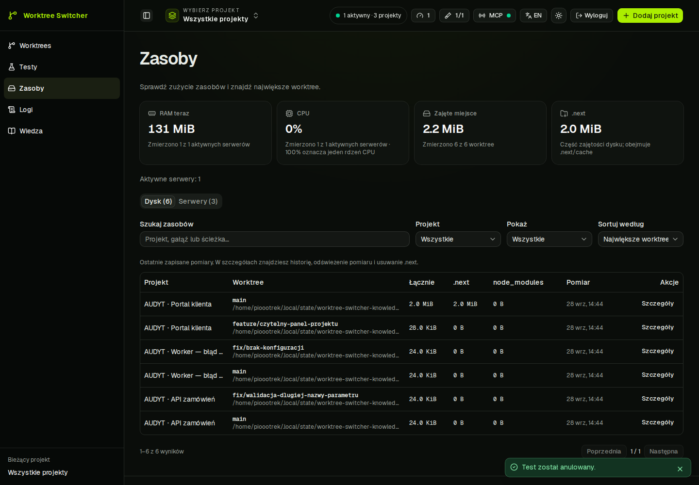
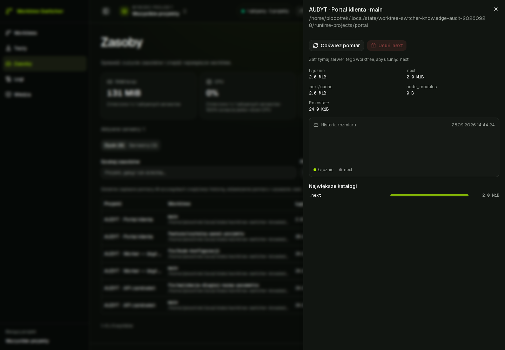

## 6. Zasoby: działające, zatrzymane i nieudane serwery — czytelne

Tabela rozróżnia Gotowy/Zatrzymany/Błąd, wyjaśnia brak pomiaru i mówi, że metryki dotyczą zarządzanych serwerów, nie całego hosta. Panel działającego serwera pokazuje RAM, szczyt, CPU i liczbę procesów. Zachować ten podział. Mała próbka nie służy ocenie wydajności aplikacji ani hosta.

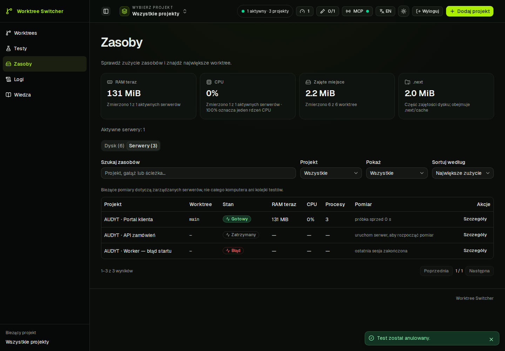
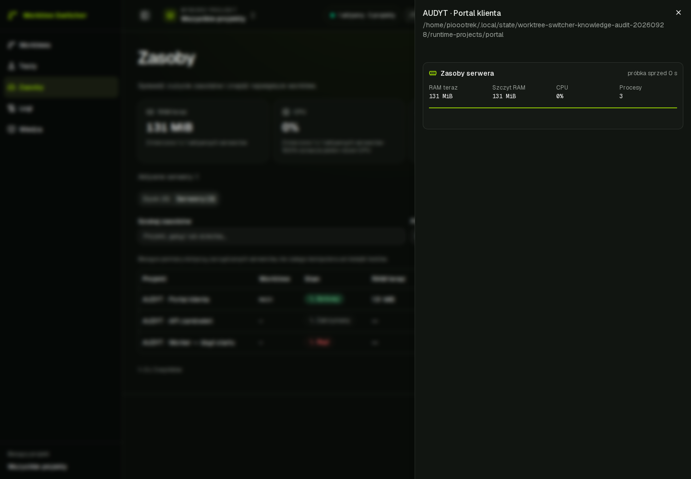

## 7. Logi: czytanie, wyszukiwanie, pobranie — lokalnie dobre, zbiorczo kłopotliwe

Logi odróżniają bieżące i ostatnie uruchomienie; pokazują limit bufora 400 wpisów. Zapytanie ERROR daje dwa zaznaczenia w Workerze. Enter przy fokusie konsoli zmienia 1/2 na 2/2, wybrane trafienie jest widoczne. Pobranie widocznego bufora dało 307 bajtów z oczekiwanym `exit_code=7`. Wyszukiwanie wstrzymuje śledzenie i pokazuje ten stan.

**RT-08, P1:** globalne zapytanie rozwija także pusty projekt i konsolę z 0 trafień. Pierwszy rzeczywisty wynik był na y=1561 przy wysokości 1000 px, bez zbiorczego skrótu do projektu zawierającego trafienie. Na telefonie na pierwszym ekranie widać pustą konsolę. Proponowane: licznik trafień per projekt, puste/bez trafień zwinięte oraz bezpośrednie przejście do pierwszego trafienia. Zachować kontekst linii i widoczny stan pauzy.

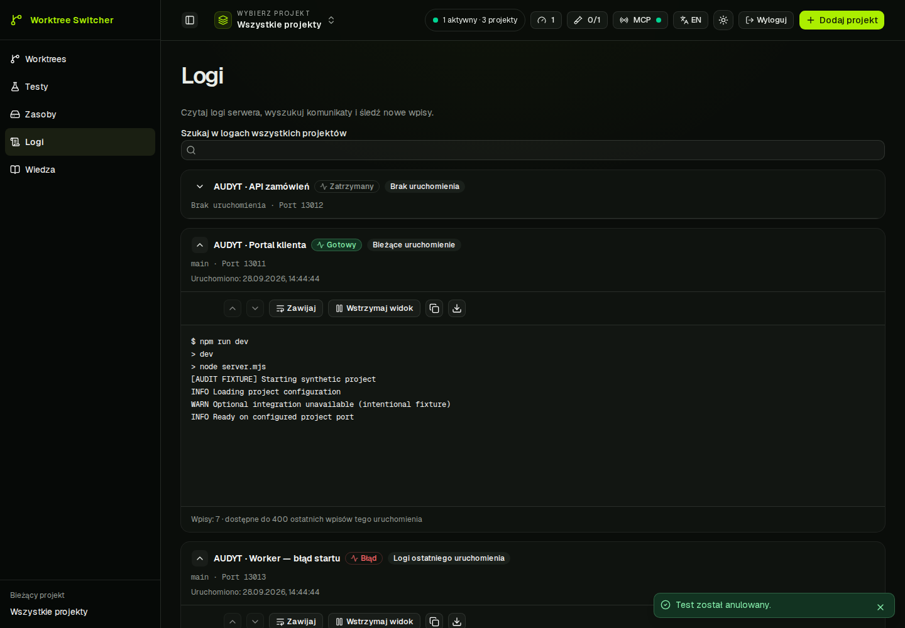
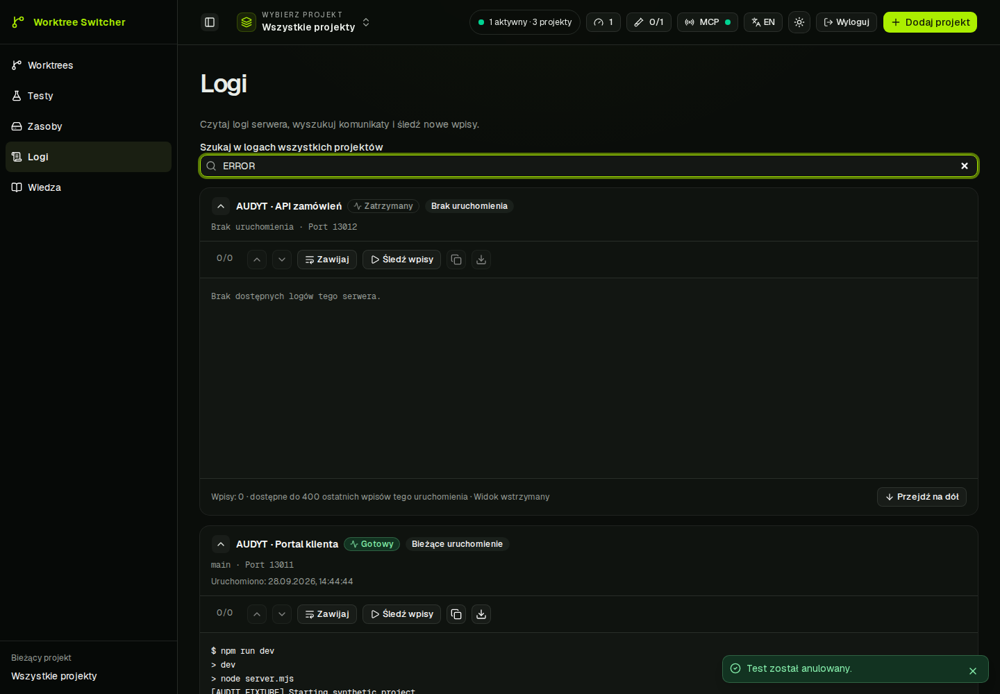
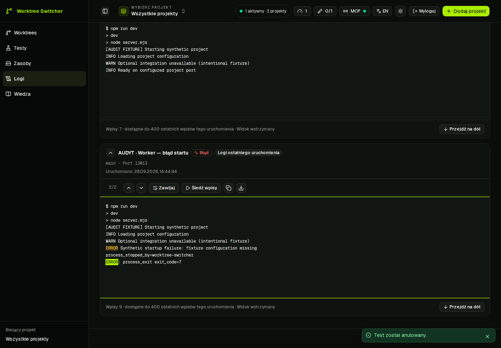
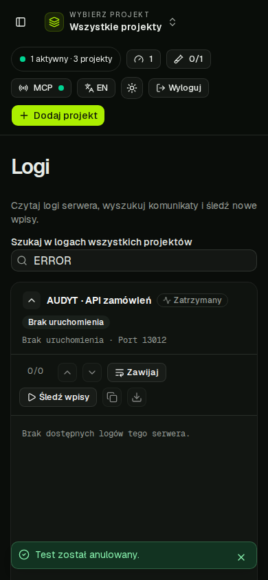

## 8. Wspólny układ mobilny i kontrola EN/light — główny problem przekrojowy

**RT-09, P1:** nagłówek przy 390 px zajmuje około 196 px. Karty podsumowań układają się pionowo przed danymi. Tabela Testów zaczyna się y=1528 (973 px szerokości), Zasobów y=1294 (885 px), Worktrees y=1198 (1322 px). Dokument ma prawidłowe 390 px szerokości; przewijanie jest wewnątrz tabel, więc problemem nie jest globalny overflow. W Worktrees po zejściu do danych widać głównie nazwę projektu i fragment gałęzi, bez stanu i akcji. To wymaga układu mobilnego dla zadania użytkownika, nie samego zmniejszenia fontu.

Proponowane: zwięzły nagłówek, kompaktowe/rozwijane podsumowanie, podstawowe wyszukiwanie i dane; dodatkowe filtry na żądanie. Wiersz mobilny pokazuje projekt, gałąź, stan i główną akcję, pozostałe pola w szczególe. Mobilna szuflada nawigacji otwiera się i zamyka po wyborze prawidłowo.

EN/light zachowuje hierarchię i powtarza problem prawej krawędzi tabeli. Istniejący komunikat anulowania pozostaje PL po przełączeniu języka — RT-10, P3, prezentacja już zapisanej wiadomości. Nie jest to błąd wyniku operacji. Osobne ryzyko kontrastu lime w jasnym motywie opisano z pomiarem w audycie Wiedzy; tutaj nie deklarujemy nowego pełnego pomiaru.

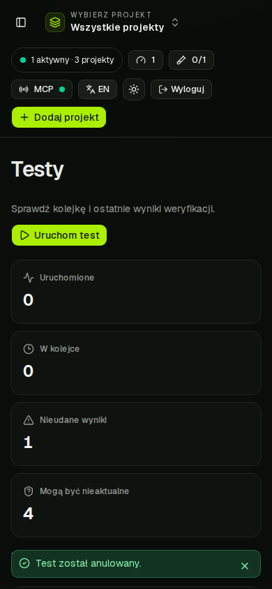
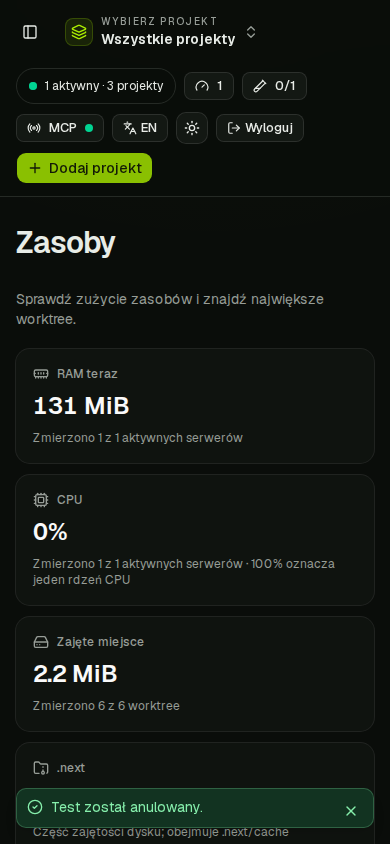
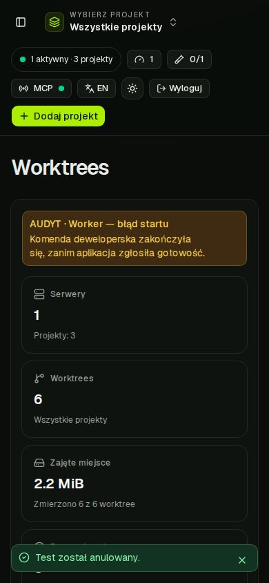
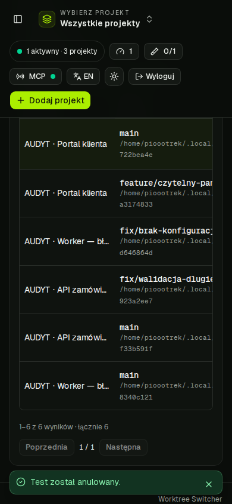
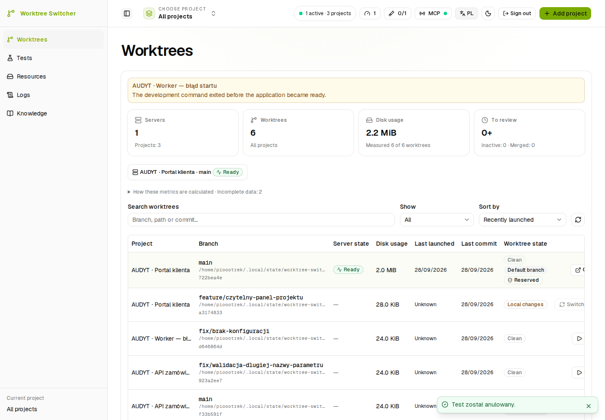

## Stan po audycie

Syntetyczny Portal zatrzymano przez MCP i zwolniono claim. API pozostało zatrzymane, Worker zachował wynik celowo nieudanego startu, bez działającego procesu. Kolejka jest pusta; wszystkie pięć testów ma stany terminalne. Zachowano repozytoria, historię i pomiary do oglądania przez właściciela. Przeglądarkę audytową zamknięto. Główny serwer pilota na porcie 3001 pozostaje uruchomiony zgodnie z prośbą właściciela; nie zmieniono jego adresu ani tokena. Nie zapisywano poświadczeń w raporcie.
