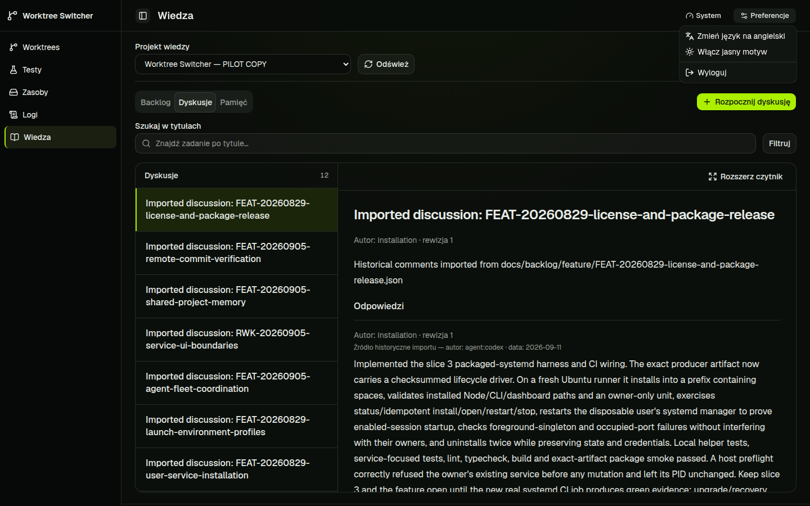

# Knowledge session action follow-up

PR: https://github.com/pioootrek/worktree-switcher/pull/61

The owner flagged Sign out of knowledge. With an installation token, that
feature-local callback signed out of the whole dashboard. The fix removes the
content-toolbar action and describes the actual scope in Preferences.

| Access mode | Action and recovery |
| --- | --- |
| Shared installation token | One global Sign out in Preferences clears both visible scopes. Knowledge rejection offers retry and guidance to replace the global session. |
| Open anonymous installation | No fictional sign-out/disconnect. Retry is available; reloading the page reprobes the current controller access mode. |
| Scoped Knowledge credential | Disconnect Knowledge access clears only the separate Knowledge session and visible content, retaining runtime access. Rejected scoped credentials can be replaced. |

`isInstallationToken` intentionally includes OPEN_ACCESS; the controller ignores
bearer credentials in open mode. This change makes that existing distinction
explicit in the UI and does not change controller authorization policy.
PL and EN labels are maintained. The reader-return correction from PR #60 is
included in the verified application source.

The first check on `b6c6197` failed because the hook return widened its access
mode to string. `43adb81` adds an explicit literal union, without a cast.
Managed check `6d2dde88-5c16-4dba-92ba-7f2eb6a31335` passed on that revision
(495 unit tests and 7 resource checks); build
`5b4656a6-04e8-42db-bf1b-067a2ee557da` passed. UI run `a338f6ed-0f66-43c3-889f-b1ed9eb1e855` passed 106 tests and failed one
new runtime-navigation assertion because its fixture had no runtime projects.
Test-only commit `c579e36` opts that stream-preservation scenario into a real
fixture runtime project; the previous stream/bootstrap assertions are retained.
Final managed UI `518a7afc-252c-4f07-a191-187187b6a16a` passed all 107 tests on
clean source `c579e36`. [GitHub Verify 36455440278](https://github.com/pioootrek/worktree-switcher/actions/runs/36455440278) passed check/build, HTTPS, integration, UI, E2E, package smoke on Node 22/24 and packaged systemd lifecycle. PR #61 merged as `cb295e4032e9dec621e7ee647772e78ddb272151` after all four jobs were green and the final review-thread check found no unresolved feedback.

Pilot acceptance on application source `43adb81`, at 1440 by 900 PL/dark,
confirmed no feature-local sign-out, exactly one global Sign out in Preferences,
and no scoped disconnect for the installation session. Clicking global Sign out
cleared both session-storage credentials and the visible Knowledge content.
Signing in again restored access. This browser used its own session; no token was
revoked or persisted in the evidence. The preview remains running on the
session-actions worktree at port 3001 with its claim released.

n8n review was dispatched once with target all. Kimi and Codex completed without
actionable findings; there are no inline threads. Claude stopped at its session
limit without reviewing. The final test-fixture correction does not change
application behavior.
