# Audyt czytania backlogu, notatek i pamięci

Audyt: 2026-09-28. Worktree Switcher, kod `e4a3a2f`. Zakres uzgodniony z właścicielem: backlog, notatki, pamięć i prowadzące do nich dyskusje; bez LLM Ops Hub. Raport uzupełnia [analizę źródłową](source-analysis.md). [Dowody i pomiary](evidence.json) zawierają również sumy kontrolne 19 obejrzanych zrzutów. [Plan poprawek](implementation-plan.md) rozpisuje zakresy i odbiór.

Interfejs pozwala dotrzeć do rekordów, ale źle obsługuje ich czytanie. Największe przeszkody to JSON zamiast notatki, dokument dostępny tylko do pobrania, zbyt dużo kontrolek przed treścią i relacje opisane identyfikatorami. Dochodzą dwa problemy z wiarygodnością odczytu: pomieszana chronologia wypowiedzi i wynik wyszukiwania, który nie prowadzi do trafionego fragmentu. To wymaga zmiany sposobu prezentowania wiedzy, nie samej palety kolorów.

## Warunki próby

Uruchomiono statyczny eksport z osobnego worktree `audit/knowledge-reading`. Build w kolejce Switchera zakończył się poprawnie na niezmienionym `e4a3a2f`. Serwer uruchomił i zatrzymał Switcher na porcie 3001, pod własną rezerwacją audytu. Po części pomiarowej przywrócono profil `default`, usunięto profil tymczasowy i zwolniono rezerwację. Następnie właściciel poprosił o możliwość własnego oglądania: tę samą kopię ponownie uruchomiono przez Switcher na porcie 3001, z profilem audytowym i nową rezerwacją. Pozostawiono ją działającą do jego prób. Adresy dostępu i token pozostają poza raportem.

Po zgodzie właściciela użyto lokalnego Chromium 149 przez Playwright 1.61.1. SQLite skopiowano spójnym backupem, załączniki skopiowano do osobnego prywatnego katalogu, a stan kontrolera utworzono od nowa. Materiałem była kopia pilota K7a: import repozytorium `8106984` oraz istniejące w pilocie zadanie, pytanie i zatwierdzona decyzja. Audyt nie zmieniał treści ani zatwierdzeń. To starszy zbiór treści oglądany w aktualnym kodzie aplikacji; nie jest odbiorem migracji produkcyjnych danych.

Każdą akcję poprzedzał odczyt DOM; każdy zachowany zrzut otwarto i oceniono. Ujęcia załączników i historii powtórzono po przewinięciu, żeby pokazywały właściwy materiał. Jeden błędnie nazwany selektor i jedna niejednoznaczna lokalizacja elementu wymagały poprawienia w narzędziu audytu; nie są błędami aplikacji. Nie użyto starych zrzutów jako dowodów.

## Ścieżka czytelnika

### 1. Wejście do wiedzy i lista backlogu — działa, orientacja przeciętna

Lista ma liczbę wpisów, statusy z ikonami, duże klikalne wiersze, wyróżniony wybór i wyraźny pusty szczegół. To dobra baza do zachowania. W pilocie widać równocześnie „Brak projektu” w nawigacji runtime i wybrany „Projekt wiedzy”. Wynika to z braku projektów runtime w tej kopii; nie dowodzi błędu wyboru projektu. Pokazuje jednak, że nazwy tych dwóch kontekstów wymagają rozróżnienia w produkcie.

Na desktopie duży nagłówek, selektor projektu, zakładki, widoki i filtry zajmują pierwsze 406 px. Czytelnik ma mniej przestrzeni na treść niż sugeruje wysokość okna. Region wyników ma nazwę dostępną dla technologii asystujących. Nie oceniano wieloprojektowego przełączania ani wydajności przy setkach rekordów.

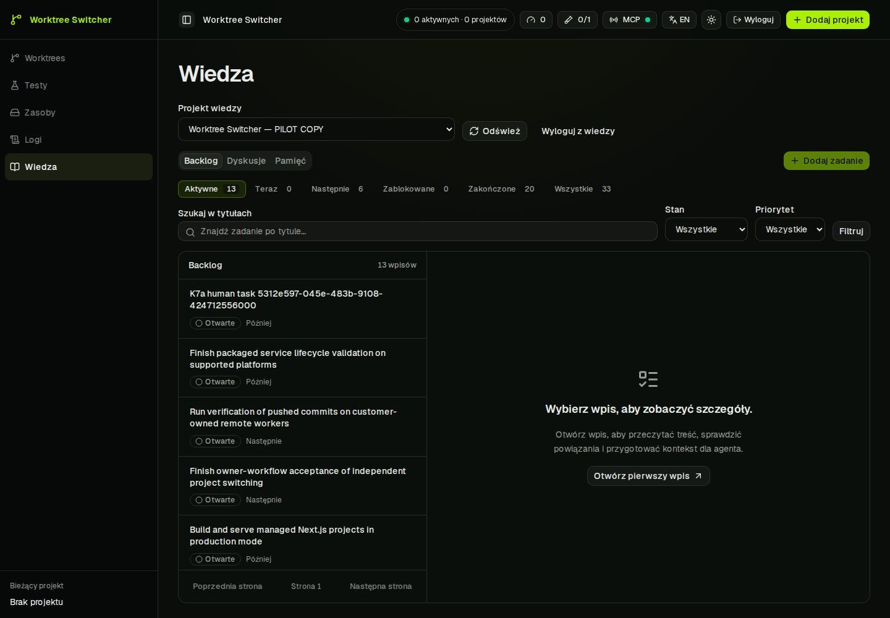

### 2. Czytanie zadania i jego relacji — istotne utrudnienia

Długi tytuł jest czytelny, status widoczny, a techniczne metadane schowane w szczegółach. Problem, zakres i kryteria odbioru są jednak jedną treścią z odstępami, bez nazw sekcji i semantycznych list (KR-04). Odbiorca musi sam rozpoznawać funkcję kolejnych akapitów.

Relacje mają działające linki, lecz pokazują „Powiązane zadanie” i hash, bez tytułu, kierunku ani rodzaju zależności (KR-05). Wybranie właściwego kontekstu wymaga zgadywania lub otwierania kolejnych rekordów. Tak samo mało informacji otrzyma użytkownik czytnika ekranu. Tytuł, typ relacji i status celu powinny być podstawową treścią linku; ID może pozostać w metadanych.

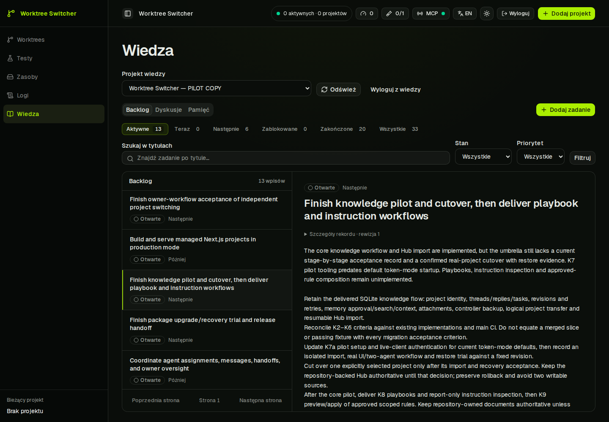

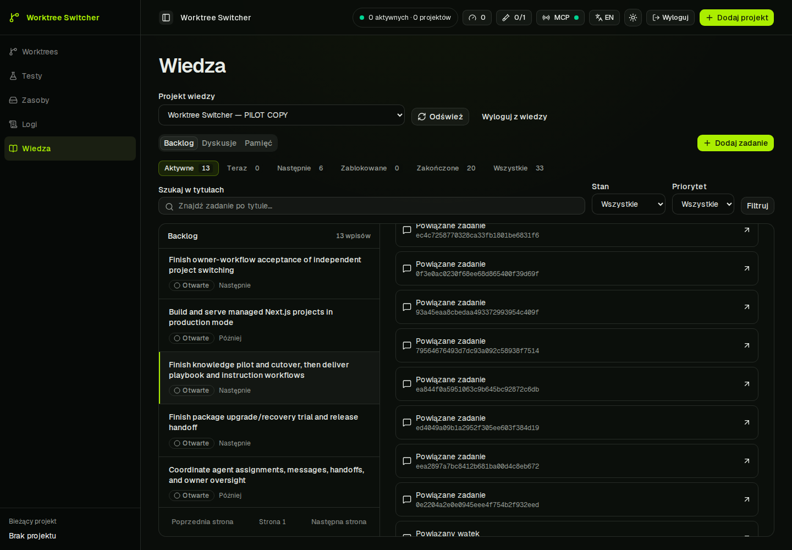

### 3. Dyskusja i rozpoznanie aktualnych ustaleń — wysokie ryzyko pomyłki

Przejście z zadania działa. Historyczny autor i data są zachowane, oddzielnie od podmiotu importującego. Jednocześnie „Imported discussion: FEAT-…” jest słabym tytułem dla człowieka, a w polskim widoku placeholder nadal mówi o znalezieniu zadania zamiast dyskusji.

KR-07 jest potwierdzony, nie jest już tylko ryzykiem z analizy kodu. W tym wątku kolejność dat to m.in. `05 → 05 → 13 → 13 → 27 → 13 → 05` września. Zrzut 05 pokazuje komentarz z 27 września przed komentarzem z 13 września. Wypowiedzi o zmieniających się decyzjach SQLite/PostgreSQL są rozdzielone innymi wpisami; nie wolno utożsamiać dolnego komentarza z najnowszą decyzją.

Przyczyna w kodzie: wspólny czas publikacji importu oraz sortowanie po ID zamiast po zachowanej kolejności źródłowej. Nie należy naprawiać tego samym sortowaniem po dacie dziennej — wiele wpisów ma tę samą datę, a daty mogą być niepełne. Potrzebna jest stabilna kolejność źródłowa i jawna polityka dla wpisów natywnych.

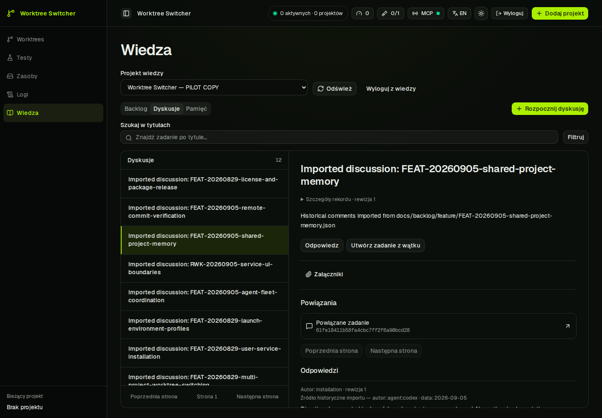

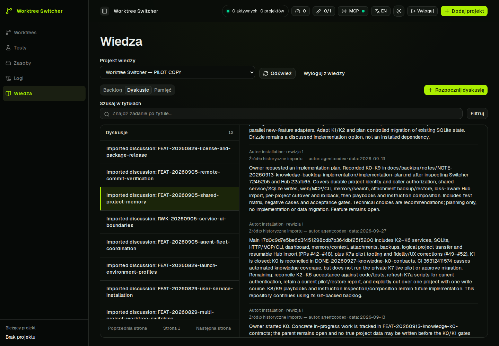

### 4. Lista pamięci i notatka — podstawowa ścieżka czytania jest zła

Na 1440×1000 pole zapytania ma **59 px szerokości** w PL; etykieta łamie się na sześć linii. W EN szerokość wynosi 109 px. Tag i identyfikator historyczny dostają znacznie więcej miejsca niż główna czynność użytkownika. To zmierzony skutek układu, a nie preferencja estetyczna (KR-16, rozwinięcie KR-10).

Lista pokazuje początki JSON z hashami zamiast streszczeń. Po wyborze „Planu wdrożenia…” szczegół również pokazuje obiekt JSON (KR-02). Nie ma sekcji dokumentów przy tytule; aktualny plan pozostaje niżej, w załącznikach. Surowa ścieżka repozytorium i SHA zajmują kilka wierszy, a autor „installation” opisuje operację importu, nie autora opracowania (KR-09).

Pusta prawa strona przed wyborem nie daje wskazówki, którą oferuje backlog. Pełnoszeroki jaskrawy przycisk dodania wpisu jest najbardziej widocznym elementem ekranu przeznaczonego również do czytania. Nie rekomenduję zmniejszania fontów: należy ograniczyć liczbę stale otwartych kontrolek.

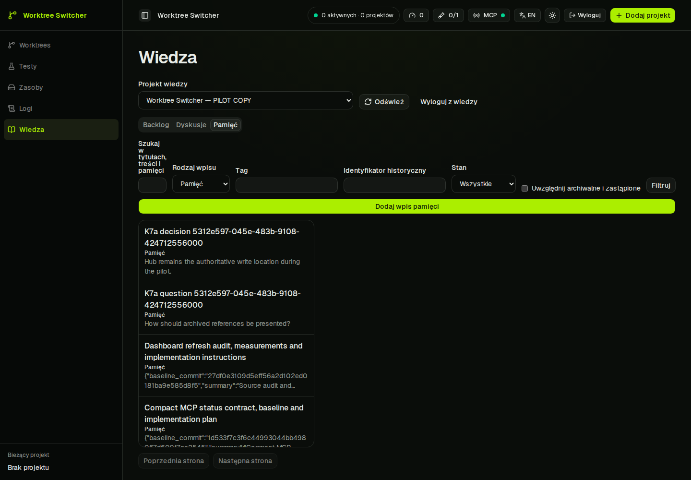

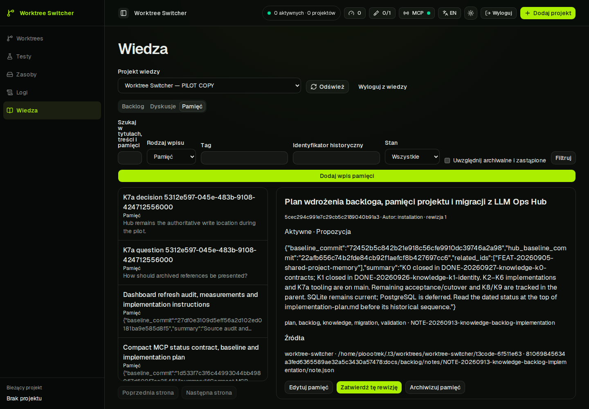

### 5. Otwieranie dokumentu i szukanie jego treści — brak czytnika, brak wyników

Załączniki można rozwinąć i pobrać. Kliknięcie „Pobierz: implementation-plan.md” faktycznie pobrało plik 34 KB; adres pozostał na rekordzie, podgląd nie powstał (KR-01). Nie utracono dokumentu: jest w kopii, ma nagłówki, tabelę etapów i linki. Brakuje sposobu przeczytania go wewnątrz Switchera.

Fraza **„Cel i granice pierwszego wydania”**, obecna jako nagłówek pobranego dokumentu, nie dała wyniku przy rodzaju „Wszystkie” (KR-03). Nie wystarczy poprawić opis pola: docelowo tekstowe dokumenty powinny być wyszukiwalne, z wynikiem prowadzącym do pliku. Pobranie oryginału należy zachować jako osobną akcję.

Lista plików ma nazwy i rozmiary; przyciski pobrania mają nazwę dostępną zawierającą plik. To wartościowe zachowania do zachowania. Nie testowano dużych plików, błędów pobrania ani renderowania obrazu — takiego czytnika tu nie ma.

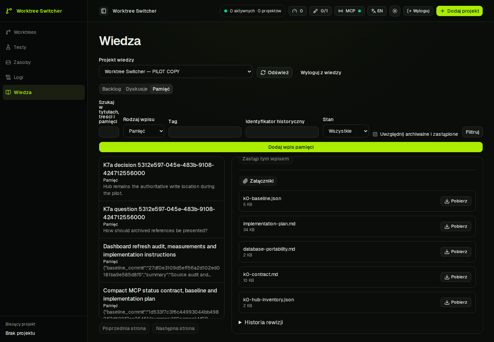

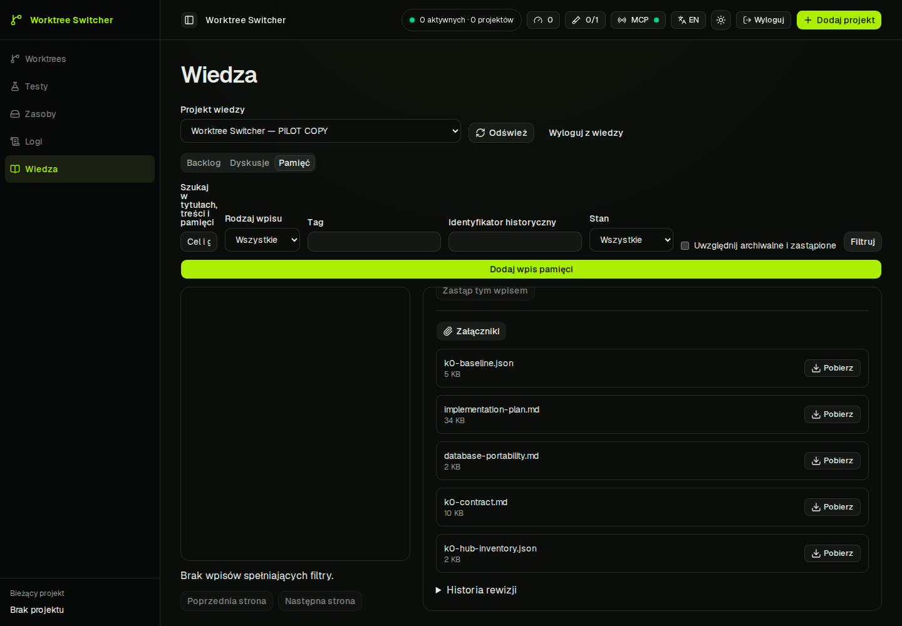

### 6. Czytanie na telefonie — pamięć znacznie gorsza od backlogu

Przy 390×844 lista pamięci zaczyna się około dolnej krawędzi pierwszego ekranu. Nagłówek aplikacji, operacje runtime, selektor projektu, filtry i przycisk dodania zajmują prawie cały widok. Po wyborze notatki formularz nadal pozostaje nad artykułem; w zmierzonym stanie początek artykułu był na y=760, a tytuł niemal poza ekranem (KR-10/KR-11). Ujęcie 12 po przewinięciu do nagłówka nadal pokazuje przede wszystkim kontrolki.

Backlog ukrywa filtry po otwarciu rekordu i pokazuje „Wróć do listy”, status oraz fragment właściwego tekstu (13). Ten wzorzec należy ujednolicić, a wspólne kontrolki ograniczyć. Wąski ekran nie miał poziomego przepełnienia dokumentu: 390 px szerokości treści przy 390 px viewportu. To nie oznacza, że cały przepływ mobilny jest wygodny.

Otwarcie zadania klawiszem Enter z uprzednio sfokusowanego linku zadziałało. Fokus trafił na BODY; następny Tab doszedł do „Wróć do listy”. Nie stwierdzono w tej próbie pułapki klawiatury. Nadal warto przenieść fokus jawnie na nagłówek oraz odtworzyć go na wybranym wierszu po powrocie. Nie testowano czytnika ekranu ani klawiatury ekranowej telefonu.

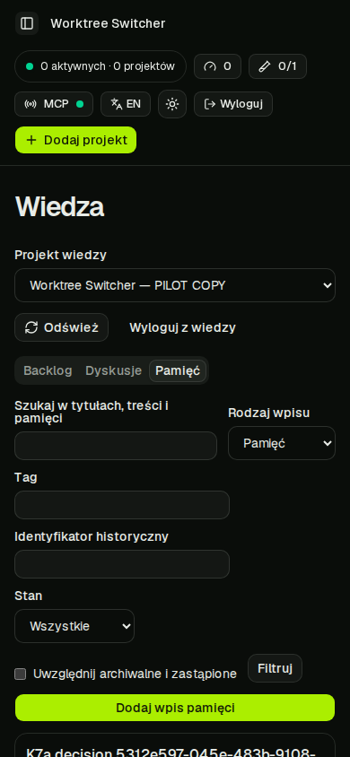

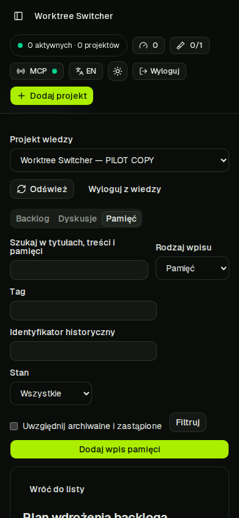

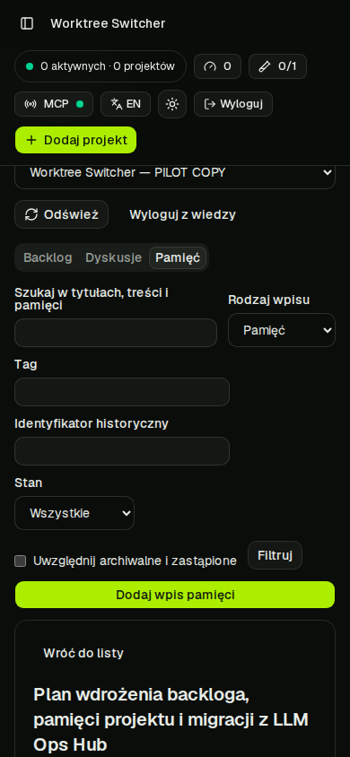

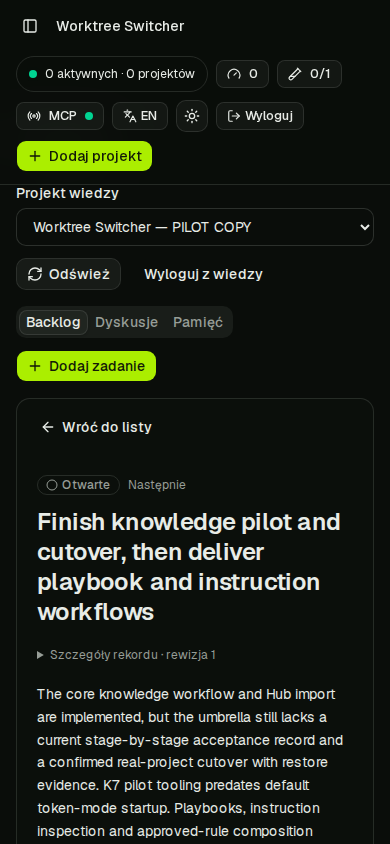

### 7. Decyzja, historia i powrót do kontekstu — funkcjonalne, mało czytelne

Natywna decyzja ma zwykłą treść i jawne „Zatwierdzone”; zatwierdzenie jest przypisane do rewizji, a ponowna akcja wyłączona. Link źródła otworzył właściwe zadanie. Tych zachowań nie należy psuć. Nazwa linku nadal jest samym ID, a autor i zatwierdzający mają techniczne identyfikatory.

Historia pokazuje `created`, `approved`, podmiot oraz poprzedni JSON, bez czytelnego porównania i daty zdarzenia w głównej prezentacji (KR-14). Formularz zastąpienia przez ID jest stale rozwinięty przed dokumentami i historią. To za dużo obsługi rekordu w ścieżce jego czytania.

Powrót „Back to list” w tej samej zakładce zachował zapytanie `K7a` i odtworzył listę. Przejście Pamięć → Backlog → Pamięć wyczyściło wcześniejsze zapytanie (KR-12). Nie należy opisywać obu sytuacji jako jednego błędu Back.

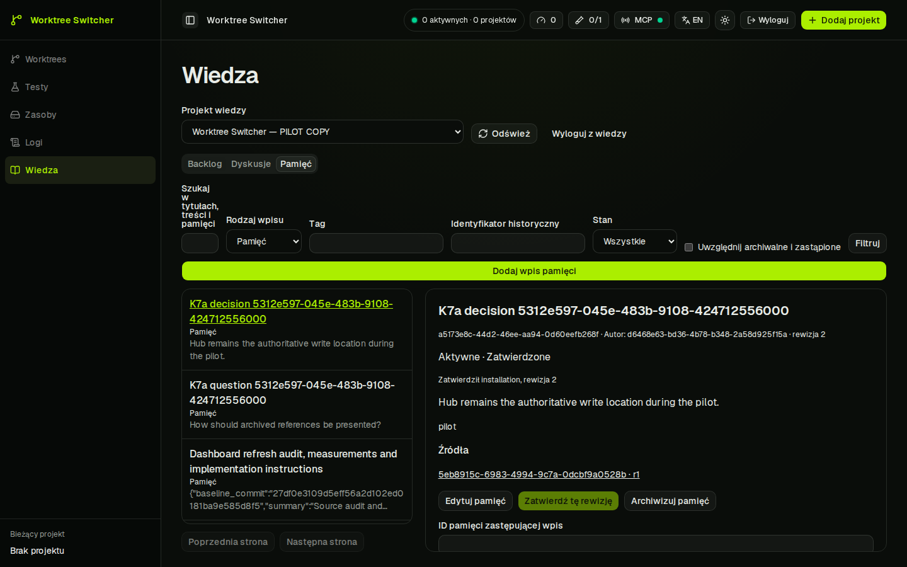

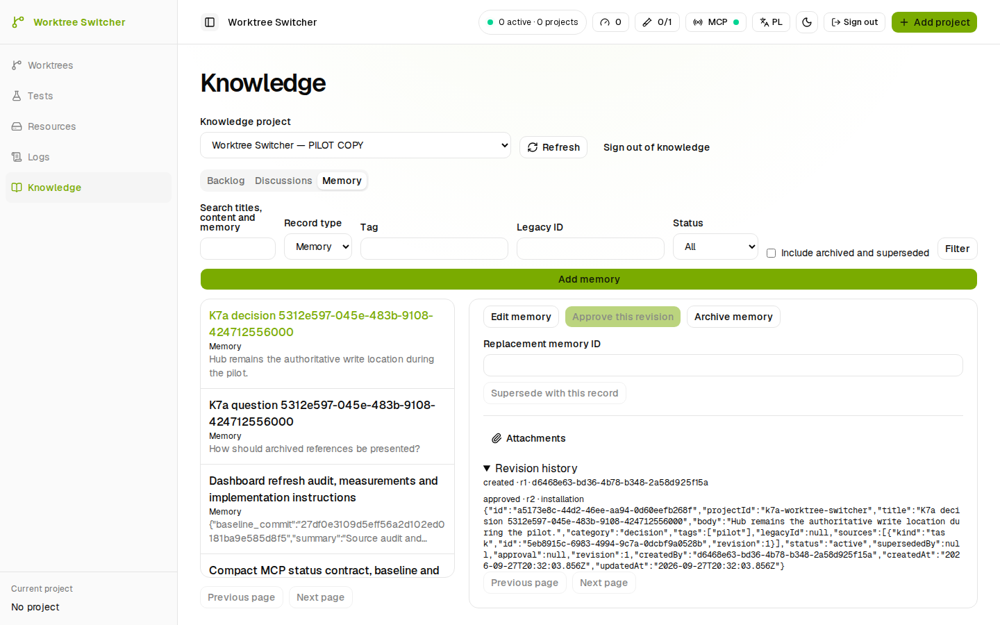

### 8. Jasny motyw, niski ekran i odnalezienie odpowiedzi — dodatkowe bariery

Jasny motyw i tłumaczenie EN działają, lecz zaznaczony link pamięci używa lime jako tekstu na bieli. Z pomiaru koloru w przeglądarce: RGB `122,171,0` na `255,255,255`, font 16 px, kontrast około **2,74:1** (KR-17). Dla takiej treści próg wynosi 4,5:1 według [W3C, SC 1.4.3](https://www.w3.org/WAI/WCAG22/Understanding/contrast-minimum.html). To pomiar konkretnego aktywnego linku, nie ocena wyłączonych przycisków ani deklaracja kompletnego audytu WCAG. Należy zastosować ciemny tekst z innym wyróżnieniem wyboru lub ciemniejszy token akcentu tekstowego.

Przy 720×450 nie ma poziomego przepełnienia dokumentu, ale pierwszy ekran kończy się już na filtrach. Jest to próba krótkiego viewportu, nie rzeczywisty test zoomu 200%.

Wyszukanie `dual-engine` w odpowiedziach daje wynik nazwany „Reply”, z początkiem tekstu zamiast trafionego fragmentu. Kliknięcie prowadzi do początku wątku. Szukana wypowiedź znajdowała się na y=2090,5 przy wysokości viewportu 1000 i przewinięciu czytnika 0; nie była wyróżniona (KR-08). Użytkownik musi odnaleźć wynik drugi raz. Zrzut 19 służy jako dowód miejsca otwarcia treści, nie ocena przejściowego zaznaczenia zakładki tuż po nawigacji.

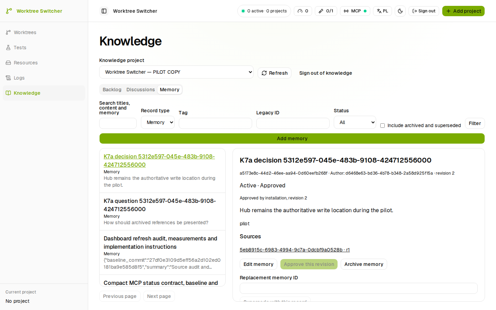

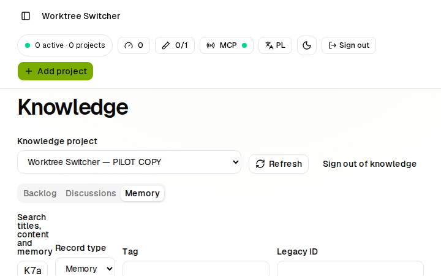

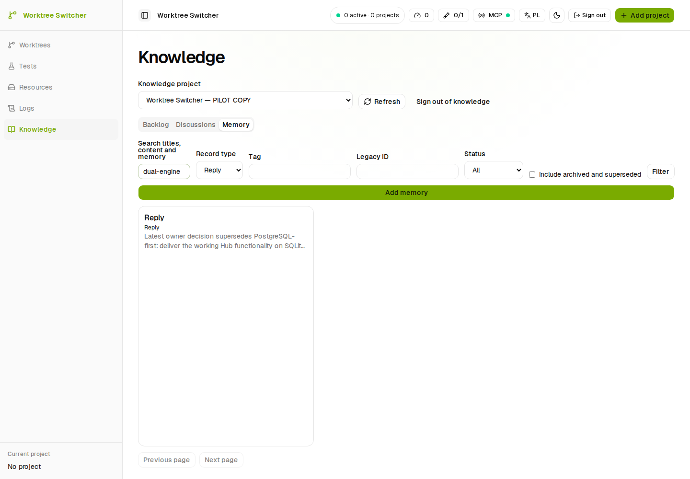

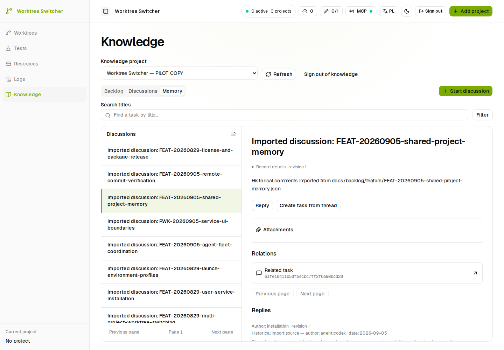

## Priorytety i granice ustaleń

P1: umożliwić czytanie dokumentu i notatki; odzyskać miejsce na zapytanie i treść; ustalić poprawną kolejność importowanych wypowiedzi; prowadzić wynik wyszukiwania do trafienia. P2: semantyczne sekcje zadania, tytuły relacji, metadane, historia, zachowanie kontekstu nawigacji oraz kontrast jasnego motywu. Priorytety są produktowe, nie oceną bezpieczeństwa.

Potwierdzono w przeglądarce KR-01–05, KR-07–12 i KR-14 w opisanych próbach. KR-06 (Markdown jako plain text) pozostaje ustaleniem z kodu; nie tworzono sztucznej treści, żeby udawać problem istniejących danych. KR-13 (błędy/loading) nie był odtwarzany przy kontrolowanych opóźnieniach i awariach. KR-15 sprawdzono częściowo; dodatkowe konkretne pomiary zapisano jako KR-16 i KR-17.

Nie sprawdzono prawdziwego urządzenia mobilnego, screen readera, pełnej kolejności tabulacji, rzeczywistego zoomu, utraty sieci, ponad 25 odpowiedzi w jednym wątku, wszystkich formatów załączników ani wszystkich stanów archiwizacji/zastąpienia. Nie uruchamiano pełnej regresji aplikacji: zmiana dotyczy tylko dokumentacji. Wynik builda nie zastępuje tych prób. Nie wyciągano wniosków o szybkości pracy użytkowników bez badania z użytkownikiem.
